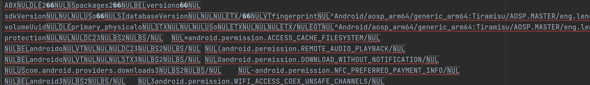

# BinaryXmlConverter

- # 背景
android从S版本开始引入了二进制xml的形式，系统中的xml数据库文件大多数默认使用二进制的形式写入。二进制xml的优势在于占用的存储空间较小。如下例子所示

```
-rw-r--r-- 1 lenovo lenovo 127771 2月  24 22:54 packages_bin.xml
-rw-rw-r-- 1 lenovo lenovo 210289 2月  25 22:56 packages_text.xm
```
二进制形式的xml比文本形式的xml大小要小一半左右。由于内容较紧凑，在对xml的读写时性能均有提升（理论推测，暂无数据支撑），但是二进制的xml文件的可读性较差，同样以上例中的二进制xml为例，打开后内容如下：

很难解读理解其中的内容。

本工具可以将xml进行转换。

- # 使用方法
  
java -jar BinaryXmlConverter.jar -i inputFile -o outputFile -b

将输入xml文件进行转换，可以将二进制的xml转换为文本格式的xml，也可以将文本格式的xml转换为二进制格式的xml

-i   指定输入的xml文件路径

-o   指定输出文件路径

-b   指定输出的文件格式为二进制格式，可选选项，未指定时默认转为文本格式
